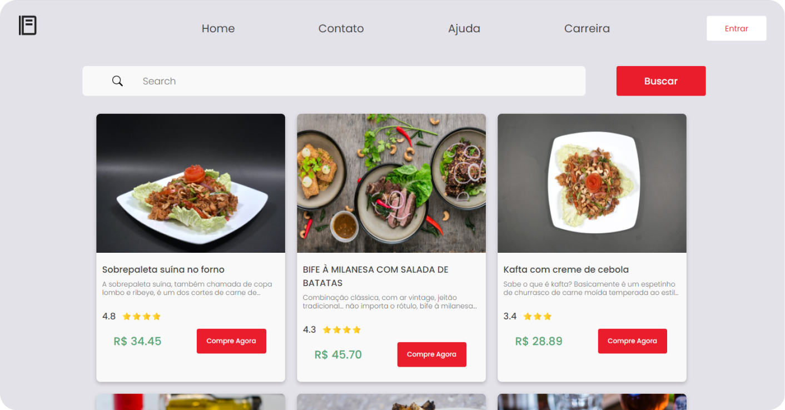
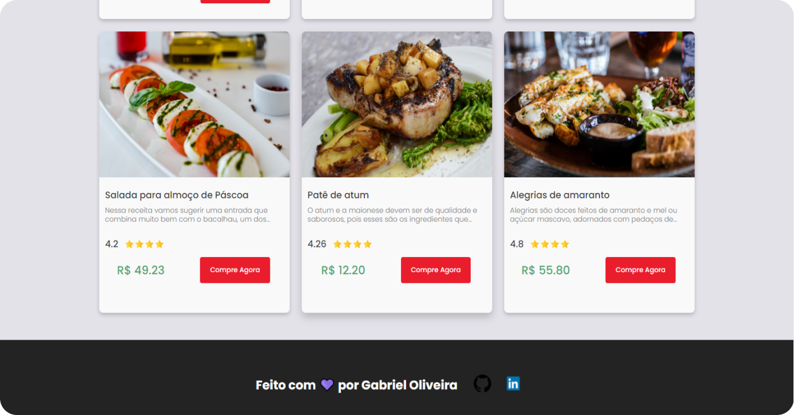
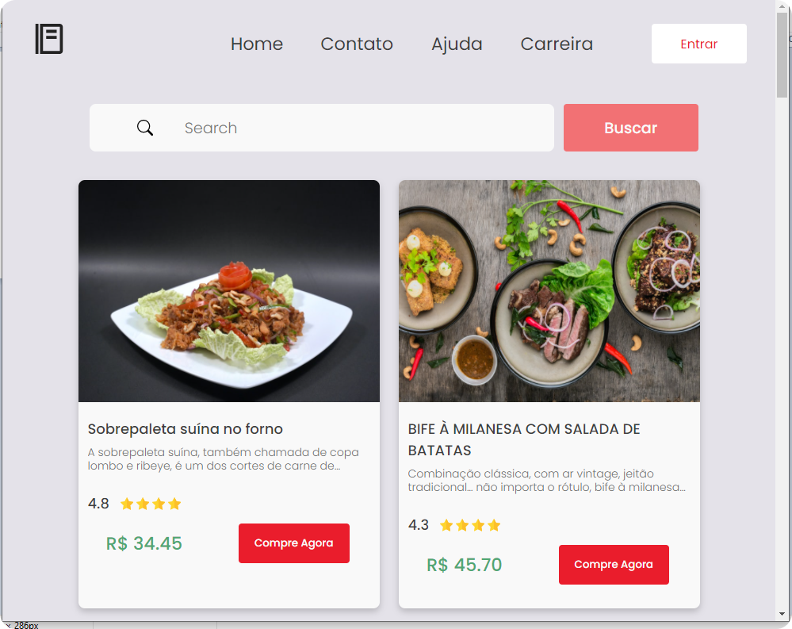
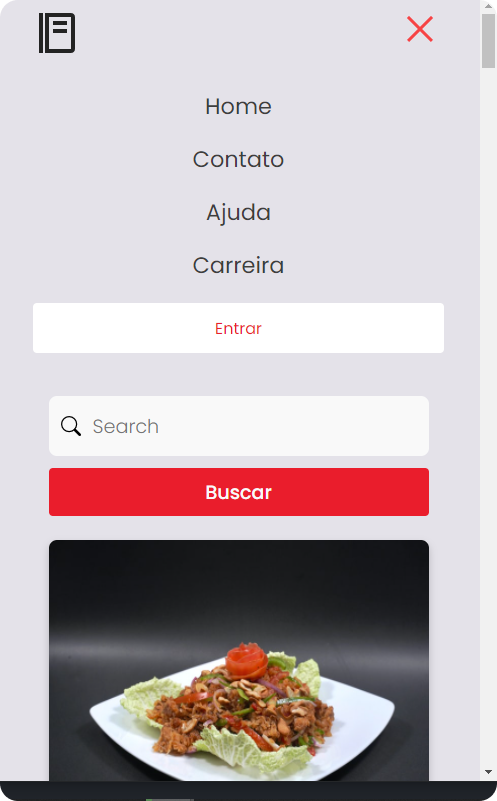

<h1 align="center">
  <br>
  <a href=""></a>
  <br>
  Delivery Food - React  
  <br>
</h1>

 <h4 align="center">Para começar a usar o React você pode acessar o site 
 <a href="https://facebook.github.io/create-react-app/docs/getting-started" target="_blank">React Get Started</a>.</h4>

 <h3>Esse é um site simples usando react</h3>

 <p float="left">
  
  
  
  
</p>

## Como usar

Para clonar e executar este aplicação, você vai precisará do [Git] (https://git-scm.com) instalado em seu computador.


```bash
#Clonando esse repositório
$ git clone https://github.com/gabriel-oliveira800/food-page-examplo-react

#Entre na pasta do projeto
$cd annotations-app

# Intale as dependencias
$ npm install 

# Rode a aplicação
$ npm start

# Build 
$npm build
```
